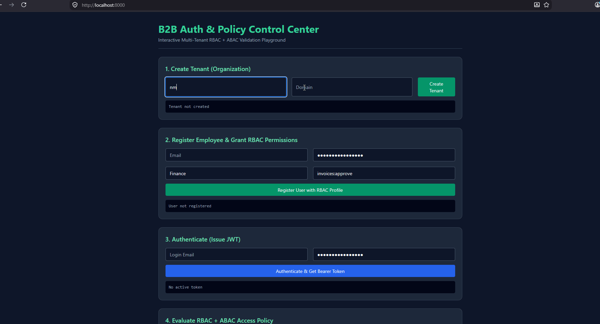

# Enterprise B2B Auth & Policy Service

Multi-tenant authentication and authorization microservice with hybrid **RBAC + ABAC** access control.

## Features

- Multi-tenancy (tenant isolation)
- Role-Based Access Control (RBAC) with fine-grained permissions
- Attribute-Based Access Control (ABAC) with dynamic rules
- JWT authentication
- Docker + Docker Compose ready
- Alembic migrations
- Example business endpoint with policy check

## Tech Stack

- Python 3.11+
- FastAPI
- PostgreSQL + SQLAlchemy 2.0
- Alembic
- PyJWT + Passlib
- Docker

## Quick Start

### 1. Clone & setup

git clone https://github.com/btwmp3/enterprise_auth.git
cd enterprise_auth
cp .env.example .env

### 2. Run with Docker

Interactive UI stand on http://localhost:8000
  It features a step-by-step interface:
  1. Company (tenant) creation
  2. User registration
  3. JWT retrieval
  4. ABAC policy verification using invoice approval as an example

Swagger UI: http://localhost:8000/docs

### 3. Basic usage flow for Swagger UI

Create a tenant (POST /api/v1/tenants)
Register a user (POST /api/v1/auth/register)
Log in and obtain a JWT (POST /api/v1/auth/login)
Create a role with permissions (POST /api/v1/roles)
Assign a role to a user
Verify access using the /api/v1/invoices/{id}/approve endpoint as an example

### 4. Project Structure

app/
├── api/          # Endpoints & dependencies
├── core/         # Security, config
├── db/           # Database session
├── models/       # SQLAlchemy models
├── schemas/      # Pydantic schemas
└── services/     # Policy engine etc.

### 5. Status
MVP / Proof of Concept.
Core RBAC + basic ABAC working. Ready for extension and integration.